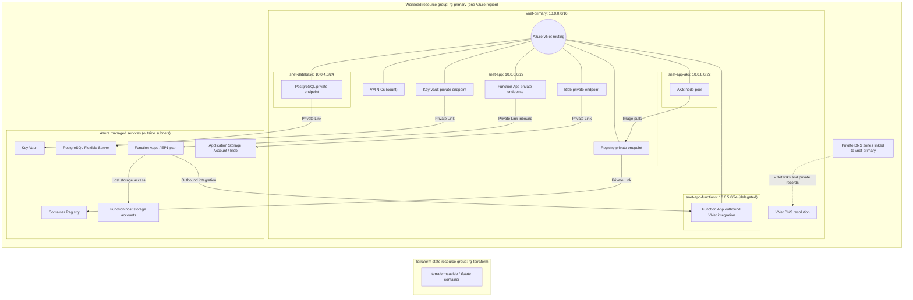

# Network boundaries and connections

This diagram shows the resources defined by the Terraform deployments. Boxes inside `vnet-primary` are subnet address spaces. PostgreSQL, Key Vault, Container Registry, Function Apps, and Storage Accounts are Azure managed services outside the VNet; their private endpoints are inside it.

The routing lines mean those subnet addresses can reach each other through the VNet. They do not represent a deployed router, application request, firewall rule, or RBAC grant. AKS nodes use their own subnet because sharing an AKS node subnet with unrelated resources can block cluster operations. The Function integration subnet is separately delegated to `Microsoft.Web/serverFarms` and cannot host the private endpoints.

| Private endpoint | Subnet | Private DNS zone |
| --- | --- | --- |
| PostgreSQL | `snet-database` | `privatelink.postgres.database.azure.com` |
| Key Vault | `snet-app` | `privatelink.vaultcore.azure.net` |
| Container Registry | `snet-app` | `privatelink.azurecr.io` |
| Function Apps | `snet-app` | `privatelink.azurewebsites.net` |
| Application Storage Blob | `snet-app` | `privatelink.blob.core.windows.net` |

The AKS node pool and VM NICs have private addresses in their subnets. Function Apps use `snet-app-functions` for outbound traffic and private endpoints in `snet-app` for inbound traffic. Their separate host storage accounts retain public network access. The application Storage Account has public network access disabled and only its Blob service has a private endpoint. The AKS API endpoint has no private-cluster setting in the current configuration.

The backend storage account in `rg-terraform` is separate from the application Storage Account in `rg-primary`. It stores Terraform state and is not connected to `vnet-primary` by this repo. See [the deployment guide](README.md) for deployment order and inputs, and [the network module](Modules/Network/main.tf) for the subnet and DNS definitions.
